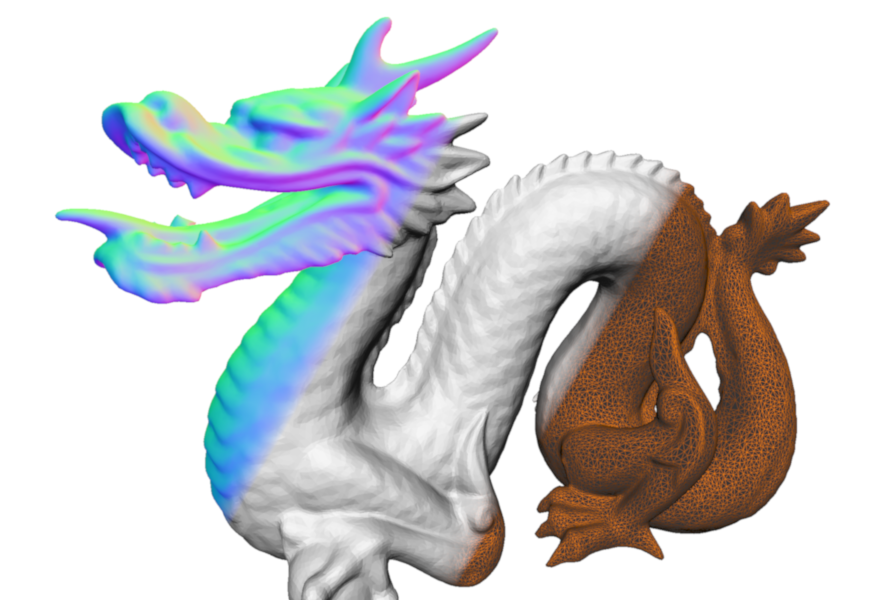
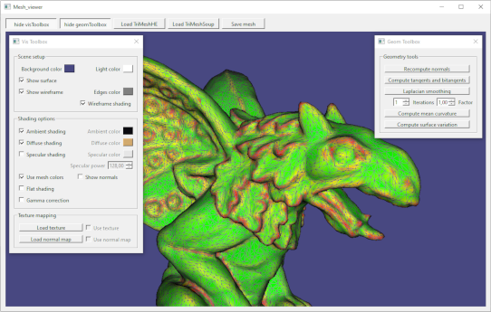

# Mesh_viewer

A simple OpenGL viewer, for quick and handy mesh visualization.  

Uses [Qt](https://www.qt.io/) for GUI, and [OpenMesh](https://www.graphics.rwth-aachen.de/software/openmesh/) for winged-edge data structure. 

Other external dependencies:
* [GLEW (The OpenGL Extension Wrangler Library)](http://glew.sourceforge.net/)
* [GLM (OpenGL Mathematics)](https://github.com/g-truc/glm)
* [Eigen](https://gitlab.com/libeigen/eigen)

The Mesh_Viewer code is also provided with **QGL_toolkit**, a simplified version of [LibQGLViewer](https://github.com/GillesDebunne/libQGLViewer) with a reduced set of essential features, re-implemented as a small header-only library.

## Prerequisite

This project has been developped on Windows, using the following setup:

* [VisualStudio 2022](https://visualstudio.microsoft.com) (community edition)
* Qt 6.7.0, using the [Qt open source](https://www.qt.io/download-open-source) installer for Windows
* [CMake]( https://cmake.org/ )

In addition of the provided code, the following libraries should be copied in a *Mesh_viewer/external* folder:
  
* OpenMesh 10.0.0, built from [sources](https://www.graphics.rwth-aachen.de/software/openmesh/download/). Use the provided Cmake script to generate a VS2022 solution (uncheck the *BUILD_APPS* option), and build the *OpenMeshCore* and *OpenMeshTools* projects to generate the corresponding lib files. 
* [GLEW](http://glew.sourceforge.net/): download the binaries for windows
* [GLM](https://github.com/g-truc/glm) and [Eigen](https://gitlab.com/libeigen/eigen) are header-only libraries, just download the sources.

## Compilation

1. Use Cmake to generate a VS solution, using the CMakeLists provided.

2. Open the solution, then set the Mesh_viewer project as startup project (right-click on the project in the solution explorer panel).
   In the project properties, go to *Configuration properties -> Debugging* and set the *Working directory* to *.\Release* or *.\Debug*, depending on your current configuration.
   
3. Workaround for the *Could not find the Qt platform plugin "windows"* error for VisualStudio project:

Go to *C:\path\to\Qt\6.7.0\msvc2019_64\plugins* and copy the *platform* folder into your executable folder (same for the dlls located in *C:\path\to\Qt\6.7.0\msvc2019_64\bin*) 

